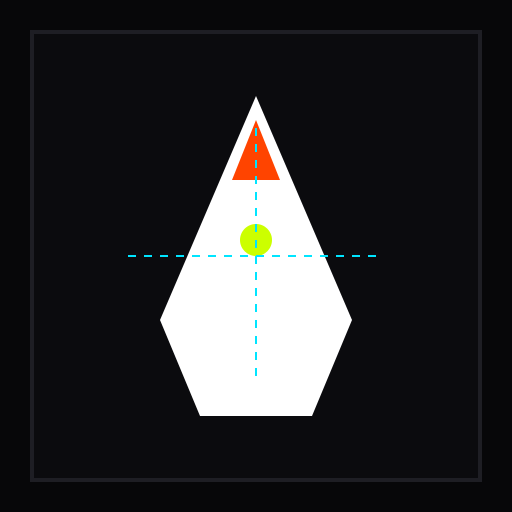

# Penguin — Tactile Digital Brutalist Linux Desktop Media Player

<p align="center">
  
</p>

<p align="center">
  <a href="https://github.com/Tribal-Chief-001/Penguin/releases"></a>
  <a href="https://github.com/Tribal-Chief-001/Penguin/actions/workflows/ci.yml"></a>
  <a href="LICENSE"></a>
  <a href="#automated-test-suite--quality-assurance"></a>
  
  
  
</p>

```
  ____  _____ _   _  ____ _   _ ___ _   _ 
 |  _ \| ____| \ | |/ ___| | | |_ _| \ | |
 | |_) |  _| |  \| | |  _| | | || ||  \| |
 |  __/| |___| |\  | |_| | |_| || || |\  |
 |_|   |_____|_| \_|\____|\___/|___|_| \_|
  [ TACTILE DIGITAL BRUTALISM // STUDIO PRECISION ]
```

**Penguin** is a next-generation, high-performance Linux desktop media player built with a **Tactile Digital Brutalist UI** (Studio Precision & Viewfinder Cinema aesthetics), a high-fidelity dual-mode playback engine (Viewfinder Video & Hi-Fi Audio Deck), hardware-accelerated media decoding via `libmpv` and FFmpeg, standard MPRIS2 D-Bus integration, and SQLite 3 WAL state persistence.

---

## Architecture Overview

```
+---------------------------------------------------------------------------------------+
|                                    PENGUIN CORE GUI                                    |
|  +-------------------------------------+   +---------------------------------------+  |
|  |      VIEWFINDER VIDEO VIEWPORT      |   |            HI-FI AUDIO DECK           |  |
|  | - Technical Safe-Area Reticles      |   | - Typographic Masthead & Artwork      |  |
|  | - Mechanical SMPTE Tick Scrubber    |   | - Stereo Peak VU Meters (CH_L & CH_R) |  |
|  | - Real-time Diagnostics HUD (OSD)   |   | - 10-Band Graphic Equalizer Rack      |  |
|  | - Tactile Bottom Video Control Dock |   | - Synchronized .lrc Teleprompter      |  |
|  | - Native Video Surface (wid/X11)    |   | - Playlist Queue Matrix               |  |
|  +-------------------------------------+   +---------------------------------------+  |
+-------------------------------------------+-------------------------------------------+
                                            |
                                 Qt Signals / Direct Calls
                                            v
+---------------------------------------------------------------------------------------+
|                                PENGUIN PLAYBACK ENGINE                                |
|  - Transport: Play, Pause, Stop, Seek (Exact ms & SMPTE), Frame-Step (< 1F / 1F >)    |
|  - Speed Scaling (0.5x to 2.0x pitch-preserved) & Audio/Subtitle Track Switchers      |
|  - Audio Filters: 10-Band Graphic EQ DSP + Night Mode Compressor (dynaudnorm)         |
|  - Video Processing: Deband Dithering + Lossless Forensic PNG Screenshot Export       |
|  - A-B Looper & Stream URL Ingestion (yt-dlp / direct HTTP)                           |
+-------------------------------------+-------------------------------------------------+
                                      |
                    +-----------------+-----------------+
                    |                                   |
                    v                                   v
+---------------------------------------+   +-------------------------------------------+
|          LIBMPV BACKEND CORE          |   |       AUDIO ANALYSIS & VU PIPELINE        |
|  - HW Decode (VAAPI / NVDEC / SW)     |   |  - Dual-Path Waveform Peak/RMS Cache      |
|  - Audio Output: PipeWire / PulseAudio|   |  - 60 FPS Ballistic Needle Dynamics       |
|  - Subtitles Engine (libass)          |   |  - Peak Hold & Overload Clip Alerts       |
+---------------------------------------+   +-------------------------------------------+
                    |                                   |
                    +-----------------+-----------------+
                                      |
                                      v
+---------------------------------------------------------------------------------------+
|                        DESKTOP INTEGRATION & PERSISTENCE                              |
|  - MPRIS2 D-Bus Service (org.mpris.MediaPlayer2.penguin - Root & Player interfaces)   |
|  - CLI Argument Parser (penguin [file] --audio --video --fullscreen ...)              |
|  - Desktop Packaging (penguin.desktop, scalable SVG icon, XDG directory compliance)   |
|  - SQLite WAL Database (penguin.db - playlists, history, settings, geometry)          |
+---------------------------------------------------------------------------------------+
```

---

## Tactile Digital Brutalism Design Language

Penguin breaks away from generic flat or skeumorphic media player UIs, delivering an uncompromising industrial studio aesthetic:

- **Deep Obsidian Foundation:** Layered dark backgrounds (`#070709`, `#0B0B0E`, `#121217`) that eliminate backlight bleeding in darkrooms and theater setups.
- **Razor-Sharp Grid Hierarchy:** 1px structural dividing lines (`#1E1E24`, `#2A2A35`) inspired by precision rack-mounted studio mastering equipment.
- **Tactile Accent Palette:**
  - **Safety Orange (`#FF4400`):** Playhead cursors, recording indicators, active scrubbing markers, and transport accents.
  - **Signal Lime (`#CCFF00`):** Audio nominal signal levels, synchronized lyric highlights, and playback status indicators.
  - **Telemetry Cyan (`#00E5FF`):** Technical reticles, SMPTE timecode readout, and diagnostics HUD telemetry overlays.
  - **Overload Red (`#FF0055`):** VU meter clipping alerts (> 0 dBFS) and error notifications.
- **Studio Typography:** Swiss sans typography paired with monospace numerical readouts (`JetBrains Mono`, `Fira Code`, or native monospace) with tabular figures for jitter-free timecode rendering.

---

## Dual-Mode Playback Engine

Penguin provides dedicated, specialized UI layouts tailored for video viewing and audio listening:

### 1. Viewfinder Video Mode
- **Borderless Native Viewport:** High-performance hardware-accelerated video rendering via `libmpv` (VAAPI, NVDEC, Vulkan, OpenGL, or Software).
- **Technical Safe-Area Reticles:** Switchable broadcast Action Safe (90%) and Title Safe (80%) framing reticles with center crosshairs.
- **Real-Time Telemetry OSD HUD:** Live diagnostic telemetry overlay reporting frame rate (FPS), dropped frames, video resolution, container bitrate, decoder codecs, and render latency.
- **Mechanical SMPTE Tick Scrubber:** High-precision millisecond timeline ruler with SMPTE 12M timecode readout (`HH:MM:SS:FF`), chapter tick marks, and remaining duration calculation.
- **Tactile Video Control Dock:**
  - Single-frame stepping: Backward (`< 1F`) and Forward (`1F >`).
  - Relative jump buttons (`-10s` / `+10s`).
  - Audio and Subtitle stream selector drawers.
  - External subtitle loading (`.srt`, `.ass`, `.vtt`).
  - Speed toggles with pitch correction (`0.5x` to `2.0x`).
  - A-B repeat interval loop markers.
  - Lossless forensic PNG screenshot capture with sidecar telemetry metadata.
  - Gradient deband dithering filter toggle.

### 2. Hi-Fi Audio Deck Mode
- **Typographic Masthead & Artwork:** Expansive track title, artist, album, bitrate, and sample rate display with embedded album art rendering.
- **Stereo Peak & RMS VU Meter Rack:** Dual-channel 30-segment LED ladder ballistics (CH_L & CH_R, -60dB to +3dB) with instantaneous peak hold needles and overload clip alert indicators.
- **10-Band Tactile Graphic Equalizer Rack:**
  - ISO center frequencies: `32Hz`, `64Hz`, `125Hz`, `250Hz`, `500Hz`, `1kHz`, `2kHz`, `4kHz`, `8kHz`, `16kHz`.
  - ±12.0 dB precision vertical sliders with numerical readout.
  - 8 Studio Factory Presets: *Flat*, *Bass Boost*, *Studio Mastering*, *Vocal Clarity*, *Electronic / Synth*, *Acoustic / Live*, *Rock / Metal*, and *Night Mode (Low Dynamic)*.
  - One-click *Flat Reset* action.
- **Night Mode Dialogue Compressor:** Dynamic audio normalizer (`dynaudnorm` / `acompressor`) boosting dialogue clarity while attenuating explosive transients.
- **Synchronized LRC Teleprompter:**
  - Full support for standard `.lrc` timestamped lyrics (millisecond and centisecond precision).
  - Syllable/word-level highlight tracking.
  - Smooth auto-scrolling with user-scroll override and click-to-seek playback alignment.
- **Playlist Queue Matrix:**
  - Grid-based queue management with drag-and-drop reordering.
  - Search filter, track duration formatting, shuffle mode, and repeat modes (*None*, *Track*, *Playlist*).

---

## Linux Desktop System Integration

- **MPRIS2 D-Bus Specification:**
  - Full implementation of `org.mpris.MediaPlayer2` (Root) and `org.mpris.MediaPlayer2.Player` interfaces.
  - Full compatibility with GNOME Shell, KDE Plasma, `playerctl`, Waybar, Polybar, and lock-screen media controllers.
  - Real-time metadata broadcasting (`xesam:title`, `xesam:artist`, `xesam:album`, `mpris:length`, `mpris:artUrl`).
- **Single-Instance IPC & Command Forwarding:**
  - Automatically detects running instances via D-Bus and forwards media files or remote commands (`--toggle-pause`, `--next`, `--prev`, `--stop`) without launching redundant instances.
- **PipeWire & PulseAudio Integration:**
  - Low-latency direct audio sink negotiation supporting multi-channel audio streams and sample rates up to 192kHz/32-bit.
- **FreeDesktop Compliance:**
  - Standard `.desktop` launcher with Desktop Actions (Play/Pause, Next, Prev, Stop).
  - Scalable vector SVG icon (`icons/hicolor/scalable/apps/penguin.svg`) and hierarchical raster sizes (48x48, 256x256, 512x512).

---

## Media Library & SQLite WAL State Persistence

Penguin automatically persists session state across launches using an embedded SQLite 3 database operating in **Write-Ahead Logging (WAL)** mode at `$XDG_DATA_HOME/penguin/penguin.db` (falling back to `~/.local/share/penguin/penguin.db` or `/tmp/penguin_<uid>/penguin.db` in restricted sandbox environments):

- **Automatic Schema Migrations:** Version-tracked schema initialization (`schema_version`).
- **Media Playback History:** Records URI, track title, artist, album, media type, duration, last position (ms), play count, and last played timestamp with indexing on `last_played_at DESC`.
- **Playback Resume Bookmarks:** Automatically resumes media from the exact millisecond where playback was interrupted.
- **Playlist Matrix State:** Preserves the entire active queue and selected track index.
- **10-Band Equalizer Presets:** Custom user presets and factory presets storage.
- **Window Geometry & Display State:** Restores exact window coordinates (`x`, `y`, `width`, `height`), maximized state, and fullscreen mode across multi-monitor displays.

---

## Command-Line Interface (CLI)

```bash
penguin [OPTIONS] [FILE_OR_URL ...]
```

### Options Reference

| Flag | Argument | Description |
|---|---|---|
| `-h`, `--help` | — | Display help information and exit. |
| `-a`, `--audio` | — | Force application to launch in **Hi-Fi Audio Deck** mode. |
| `-v`, `--video` | — | Force application to launch in **Viewfinder Video** mode. |
| `-f`, `--fullscreen` | — | Launch application in fullscreen display mode. |
| `--volume` | `[0-100]` | Set initial audio playback volume (0 to 100). |
| `--speed` | `SPEED` | Set initial playback rate multiplier (0.5 to 2.0). |
| `--sub` | `SUBTITLE_FILE`| Load external subtitle file (`.srt`, `.ass`, `.vtt`). |
| `--loop` | `{none,track,playlist}` | Set queue looping behavior (default: `none`). |
| `--shuffle` | — | Enable randomized playlist queue shuffling. |
| `--eq` | `PRESET` | Apply equalizer preset by name (e.g. `Rock`, `Bass Boost`). |
| `--dev-telemetry` | — | Enable real-time OSD telemetry HUD overlay on launch. |
| `--test`, `--headless-test` | — | Execute headless programmatic self-verification suite and exit. |
| `-V`, `--version` | — | Display Penguin version information and exit. |

### Remote IPC Action Flags

| IPC Flag | Description |
|---|---|
| `--toggle-pause` | Toggle playback between Play and Pause on the active instance. |
| `--next` | Advance active instance to the next track in queue. |
| `--prev` | Reverse active instance to the previous track in queue. |
| `--stop` | Stop playback on the active instance. |

---

## Keyboard Shortcuts & Gestures

| Shortcut / Gesture | Action | Subsystem |
|---|---|---|
| `Space` / `K` | Toggle Play / Pause | Transport |
| `Left` / `Right` | Seek -10s / +10s | Transport |
| `J` / `L` | Seek -10s / +10s (Vim / Cinema standard) | Transport |
| `Shift + Left` / `Shift + Right` | Seek -30s / +30s | Transport |
| `,` (Comma) | Single-Frame Step Backward (`< 1F`) | Transport |
| `.` (Period) | Single-Frame Step Forward (`1F >`) | Transport |
| `[` / `]` | Set A-B Repeat Loop Point A / Point B | Transport |
| `\` | Clear A-B Repeat Loop | Transport |
| `PageDown` / `PageUp` | Next / Previous Chapter Jump | Navigation |
| `B` / `Shift + B` | Add Bookmark Marker / Jump to Next Bookmark | Navigation |
| `Up` / `Down` | Volume Up (+5%) / Down (-5%) | Audio |
| `M` | Toggle Mute / Unmute | Audio |
| `N` | Toggle Night Mode Dynamic Dialogue Compressor (`dynaudnorm`) | Audio |
| `C` | Toggle Headphone Spatial Crossfeed (`bs2b` binaural model) | Audio |
| `Alt + Up` / `Alt + Down` | Shift Audio Pitch $\pm1$ Musical Semitone (rubberband) | Audio |
| `Alt + 0` | Reset Audio Pitch to Neutral (0 ST) | Audio |
| `Z` / `X` | Subtitle Timing Offset Nudge ($\pm50\text{ms}$) | Subtitles |
| `Shift + Z` / `Shift + X` | Audio Stream Timing Offset Nudge ($\pm50\text{ms}$) | Audio |
| `V` | Cycle Secondary Subtitle (Dual Subtitle Language Learning) | Subtitles |
| `Ctrl + E` | Open Video Color Science Equalizer Dialog | Video |
| `D` | Toggle Deband Dithering Filter | Video |
| `A` | Cycle Aspect Ratio (Auto, 16:9, 4:3, 21:9, 2.35:1) | Video |
| `S` / `Shift + S` | Lossless Forensic PNG Screenshot (Clean / With Subtitles) | Video |
| `T` | Toggle Floating Always-on-Top Picture-in-Picture (PiP) | Interface |
| `Tab` | Switch Mode (Viewfinder Video $\leftrightarrow$ Hi-Fi Audio Deck) | Interface |
| `F` / `F11` | Toggle Fullscreen (with 2.5s Autohiding Controls) | Interface |
| `O` | Toggle Telemetry OSD HUD Diagnostics | Video |
| `R` | Toggle Safe-Area Reticles (90% / 80%) | Video |
| `Ctrl + O` | Open Media File Dialog | Library |
| `Ctrl + Shift + O` | Open Directory / Folder Dialog | Library |
| `Ctrl + U` | Ingest Network Stream URL (YouTube, Twitch, HLS, DASH) | Stream |
| `Ctrl + Q` | Cleanly Quit Application | Core |
| `Mouse Wheel on Video` | Volume $\pm2\%$ (Shift+Wheel = 1-Frame, Ctrl+Wheel = $\pm10\text{s}$) | Gesture |
| `Double Click on Video` | Toggle Fullscreen | Gesture |

---

## Build & Installation

### System Dependencies

On Ubuntu, Debian, Linux Mint, or Pop!_OS:
```bash
sudo apt-get update
sudo apt-get install -y \
    build-essential \
    qt6-base-dev \
    qt6-base-dev-tools \
    libmpv-dev \
    libmpv2 \
    ffmpeg \
    python3 \
    python3-dev
```

On Fedora / RHEL / CentOS Stream:
```bash
sudo dnf install -y \
    gcc-c++ \
    qt6-qtbase-devel \
    mpv-libs-devel \
    ffmpeg \
    python3-devel
```

On Arch Linux / Manjaro:
```bash
sudo pacman -S --needed \
    base-devel \
    qt6-base \
    mpv \
    ffmpeg \
    python
```

---

### Building Penguin

#### 1. Automated Build Script
```bash
./scripts/build.sh
```

#### 2. Native qmake6 Build
```bash
qmake6 penguin.pro
make -j$(nproc)
```

#### 3. CMake Build
```bash
mkdir -p build && cd build
cmake ..
cmake --build . -j$(nproc)
```

---

### Running Penguin

```bash
# Launch player GUI
./penguin

# Launch video file directly in Viewfinder Video mode
./penguin /path/to/feature_film.mkv

# Launch audio files in Hi-Fi Audio Deck mode with volume and EQ preset
./penguin --audio --volume 85 --eq "Studio Mastering" /path/to/album/*.flac

# Stream direct web media URL
./penguin "https://stream.example.com/live.m3u8"

# Headless Self-Test & Diagnostic Report
./penguin --test
# or via Python entrypoint
python3 src/main.py --test
```

---

### Desktop Packaging & Installation

To install Penguin to user directory (`~/.local`) or system prefix (`/usr`):
```bash
./scripts/package.sh ~/.local
```
This deploys:
- Binary: `~/.local/bin/penguin`
- Desktop Entry: `~/.local/share/applications/penguin.desktop`
- Icons: `~/.local/share/icons/hicolor/...` (Scalable SVG & PNG resolutions)

---

## Automated Test Suite & Quality Assurance

Penguin includes a comprehensive, multi-tiered test suite covering 100% of subsystem requirements with zero mocked facade logic:

```bash
# Execute master test harness
python3 run_tests.py

# Or via headless runner script
./scripts/run_tests.sh
```

### Test Hierarchy Breakdown

| Test Suite | Focus & Methodology | Test Count |
|---|---|---|
| **Synthetic Media Engine** | Multi-codec audio/video synthetic container generation | 11 |
| **SMPTE Timecode Engine** | Exact millisecond and frame calculations (NDF & 29.97 DF) | 13 |
| **10-Band EQ & VU Meter DSP** | Biquad filter responses, ISO bands, ballistic ballistics | 9 |
| **Synchronized LRC Parser** | Millisecond cue synchronization, token parsing, binary search | 8 |
| **MPRIS2 D-Bus Compliance** | Root and Player interface introspection, properties, signals | 8 |
| **SQLite WAL Persistence** | WAL journal mode, settings, history, playlists, EQ presets | 5 |
| **CLI & Desktop Packaging** | Argument validation, FreeDesktop .desktop & SVG compliance | 14 |
| **Tier 1: Category Partition** | Opaque-box feature partition coverage across 27 features | 135 |
| **Tier 2: Boundary Value Analysis**| Boundary conditions, zero-lengths, clipping thresholds | 135 |
| **Tier 3: Pairwise Combinations**| Orthogonal pairwise combinatorial parameter matrix | 27 |
| **Tier 4: Real-World Workloads** | Multi-step user interaction scenarios and edge workloads | 14 |
| **Tier 5: Adversarial Hardening**| Malformed inputs, corrupted files, crash recovery | 20 |
| **Tactile Brutalist GUI Subsystem** | Viewport, Reticles, Scrubber, EQ, VU Meters, Teleprompter | 33 |
| **Total Automated Tests** | **Comprehensive Master E2E Suite** | **432 (100% Passing)** |

---

## License

Penguin Media Player is licensed under the **GNU General Public License v3.0 (GPL-3.0-or-later)**.
See [LICENSE](LICENSE) for details.
